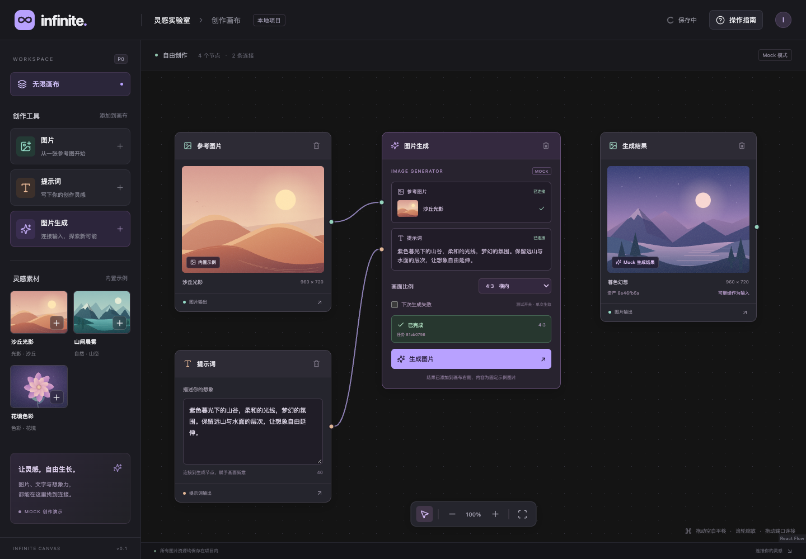

# Infinite · 智能无限画布 P0 Demo

一个单项目、纯前端的图片创作画布。将图片和提示词连接到生成节点，观察异步任务，处理失败与重试，再把生成结果作为下一次创作的输入。首次打开为空画布，无需账号、API Key 或后端服务。

## 启动与检查

需要 Node.js 20 或更新版本及 npm。依赖清单见 `package.json`，精确依赖由 `package-lock.json` 固定。

```bash
npm ci
npm run dev
```

打开终端输出的本地地址，默认是 `http://127.0.0.1:5173`。本地保存按浏览器和站点来源隔离；请使用相同协议、域名及端口打开同一份画布。

```bash
npm test          # 领域与任务单元测试
npm run build    # TypeScript 检查及生产构建
npm run test:e2e # Chromium 浏览器验收
```

浏览器验收优先使用 macOS 已安装的 Google Chrome；其他环境可先运行 `npx playwright install chromium`。也可用 `PLAYWRIGHT_CHROME_EXECUTABLE` 指定 Chrome 可执行文件。Playwright 会自动启动本地开发服务；已有同地址服务时，本地运行可复用。

生产构建后可运行 `npm run preview` 查看。无需提交 `node_modules` 或测试缓存。

## P0 功能与操作

| 操作 | 方法 |
| --- | --- |
| 创建节点 | 点击左侧“图片”“提示词”“图片生成”，或点击一张内置素材 |
| 移动节点 | 拖动节点标题栏；文本框和参数控件保持可编辑 |
| 平移与缩放 | 拖动画布空白平移，滚轮以指针为中心缩放；底部提供缩放与适配按钮 |
| 选择与删除 | 点击节点或连接选择，按 Delete / Backspace；节点标题也有删除按钮 |
| 取消选择 | 点击画布空白 |
| 连接输入 | 从图片／提示词右侧输出端口，拖到生成节点左侧对应输入端口 |
| 生成 | 连接一张图片及非空提示词，选择比例，再点击“生成图片” |
| 失败与重试 | 勾选“下次生成失败”触发一次失败，随后点击“重试生成” |
| 继续创作 | 将成功产生的结果图片连接到另一个生成节点 |

图片和提示词输入端口各接受一条连接。类型错误、自连接及重复连接会被拒绝。生成节点展示当前连接的图片和实时提示词；编辑提示词会更新展示，已提交任务保留其输入快照。

任务经历约 600 ms 排队和 1600 ms 生成后完成。排队／生成期间禁用该节点的重复提交与参数修改。一次性失败开关在提交时消耗，失败原因会显示在节点中；重试创建新任务，使用失败或中断任务保存的输入与比例。若想采用编辑后的输入，可点击“使用当前输入重新生成”。

每次成功创建独立任务、资产和图片节点，保留原始图片。输出使用固定的本地 mock 图片，界面明确标注。比例参数进入任务快照及结果尺寸元数据；当前 demo 不执行真实图片模型或图像处理。

## 3～5 分钟演示路径

1. 从左侧创建“沙丘光影”、提示词和生成节点，输入一段提示词并选择比例。
2. 平移、滚轮缩放，拖动节点标题，展示缩放后移动仍稳定；点击空白取消选择。
3. 将图片和提示词输出连接到对应输入，编辑文本，展示生成节点的输入同步更新。
4. 点击生成，展示排队、生成中、完成和新图片节点；原图仍在。将结果连接到第二个生成节点。
5. 在原生成节点勾选“下次生成失败”，展示错误及重试；说明重试采用任务原快照。
6. 调整视口并刷新，展示节点、连接、结果和任务终态恢复；再在生成中刷新，展示“已中断”及重试。
7. 删除一张连接中的源图片，说明连接同步清理、历史资产保留。说明固定 mock、单标签页及本地存储限制。

## 数据模型与关键实现

一份版本化 `CanvasDocument` 是领域数据源，包含 `nodes`、`edges`、按 ID 索引的 `assets`、`tasks` 和 `viewport`。React Flow 的选择、尺寸测量及拖拽瞬态不进入保存数据。

```text
image node --assetId--> Asset
image/prompt node --Edge--> generator node
Task --nodeId--> generator node
Task --input snapshot--> image asset + prompt text + ratio
Task --resultAssetId--> result Asset <--assetId-- result image node
```

节点、资产和任务分别拥有稳定 ID。图片节点只是资产的画布表示；删除节点清理全部关联连接，保留资产与任务历史。任务中的源节点 ID 是追踪信息，允许对应画布节点已被删除；输入图片资产和文本快照仍保留。删除排队／运行中的生成节点会中断其任务，异步回调检查任务状态与节点存在性，防止迟到回调创建孤立结果。

坐标以画布世界坐标保存。设 `p_w` 为世界坐标，`p_s` 为相对画布容器的屏幕坐标，`t` 为视口平移，`z` 为缩放：

```text
p_s = z * p_w + t
p_w = (p_s - t) / z
拖动：delta_world = delta_screen / z
鼠标锚定缩放：p_anchor = (p_pointer - t) / z
              t_new = p_pointer - z_new * p_anchor
```

浏览器 client 坐标需先减去画布容器左上角。创建节点使用 React Flow 的 `screenToFlowPosition`，拖动、端口连接和指针锚定缩放由 React Flow 处理，受控事件将结果写回领域状态。恢复页面时使用保存的视口，不自动适配而覆盖它。

## 保存、恢复与 mock 边界

- 使用 localStorage，键为 `infinite-canvas:v1`，文档字段 `version` 为 `1`。仅保存元数据和稳定的 `/samples/*.svg` 引用，不保存二进制、临时 object URL 或远程图片地址。
- 节点编辑、视口和连接变化自动保存，连续交互做防抖；任务状态变化及页面离开时及时保存。界面显示保存状态和异常。
- 刷新后，成功与失败记录保留；`queued`／`running` 转为 `interrupted`，说明页面刷新导致中断，允许使用原快照创建新任务。
- 恢复校验版本、字段、有限坐标、资源路径及图关系。损坏或未知版本数据保留原值，展示恢复失败；只有用户点击“新建本地画布”才允许替换原数据。
- 存储不可用或写入失败时显示“保存失败”，提供重试，不能视为已持久化。

本地存储适合当前少量节点与资源引用。未来若加入上传，图片文件应存 IndexedDB 或后端对象存储，领域文档继续保存资产 ID；现有版本不包含上传或跨设备同步。

## 技术取舍、依赖与 AI 归属

| 依赖／资源 | 承担的工作 |
| --- | --- |
| React、React DOM | 组件渲染与界面交互 |
| TypeScript | 领域类型及静态检查 |
| Vite、React 插件 | 本地开发及生产构建 |
| React Flow (`@xyflow/react`) | 画布坐标、视口、节点拖动、连接与选择 |
| Zustand | 受控领域状态和操作接口 |
| Tailwind CSS、Vite 插件 | utility 样式、设计 token 和构建集成 |
| lucide-react | 界面图标 |
| Vitest | 领域与任务单元验证 |
| Playwright | 实际浏览器交互、刷新和坐标验收 |
| 内置 SVG | 本题自创的沙丘、山湖、花瓣和暮色风景，无外链素材 |

本题实现的关键部分是领域实体及引用关系、类型化连接校验、任务输入快照与异步生命周期、一次性失败／重试、独立结果、删除清理、版本化恢复及自定义节点界面。React Flow 的通用画布能力直接复用库实现。界面使用 Tailwind utility classes 与语义设计 token，共享按钮和节点结构通过组件复用。原生 CSS 仅保留基础规则及 React Flow 覆盖。

开发过程使用 Codex 辅助需求梳理、OpenSpec 规划、编码和验证；相关决定与真实验证结果记录在 [AI 使用记录](docs/AI_USAGE.md)。该记录是当前可获取对话的整理稿，不冒充原始完整导出。OpenSpec 规划工件位于 `openspec/changes/build-p0-canvas-demo/`。

## 前端架构

应用入口位于 `src/app/App.tsx`，仅组合 Provider 与 `WorkspacePage`。页面、canvas/workspace feature、共享 UI、hooks、store、持久化服务及图工具按职责分层；现有业务与存储格式保持不变。目录、依赖方向、样式规则及扩展约定见 [前端架构与维护约定](docs/FRONTEND_ARCHITECTURE.md)。

2026-10-01 架构重构验收：26 项单元测试、10 项浏览器 E2E、TypeScript 检查与生产构建通过；包含响应式布局和任务状态的 11 组视觉场景与重构前逐像素一致。

随后按 OpenSpec 的 3 项能力、13 条需求和 15 个场景逐项复验，新增 7 项浏览器验收；26 项单元测试、完整 17 项 E2E、TypeScript 检查、生产构建及 OpenSpec 严格校验全部通过，未发现已有功能回归。需求与实现、测试的对应关系和复现命令见 [重构后 OpenSpec 验收报告](openspec/changes/build-p0-canvas-demo/verification.md)。

## 验证状态与已知限制

P0 初次验收（2026-10-01，Node 20.16 / Chrome）的记录如下；架构重构后的验收见上节：

| 检查 | 实际结果 |
| --- | --- |
| `npm test` | 26 项通过：10 项领域、16 项 store／任务测试 |
| `npm run test:e2e` | 8 项真实浏览器验收全部通过，33.5 秒 |
| `npm run build` | TypeScript 检查与 Vite 生产构建通过 |
| `openspec validate build-p0-canvas-demo --strict` | 严格校验通过 |
| `npm ci --dry-run` | 锁文件安装检查通过 |
| 依赖安装审计 | 升级测试依赖后为 0 vulnerabilities |

浏览器验收发现并修复了重复创建生成节点重叠的问题，创建逻辑现在按世界坐标寻找空位；标题拖动从按下即开始，以确保完整指针位移按缩放比例换算。测试同步也改为等待保存完成，损坏数据在下一页面初始化前注入，避免旧页面的离开保存覆盖测试数据。

真实界面截图：[空画布](docs/evidence/canvas-empty.png)、[生成成功](docs/evidence/canvas-generated.png)、[结果复用验收](docs/evidence/canvas-reuse.png)。这些截图由实际本地运行和浏览器操作产生。完整临时测试报告可在运行 `npm run test:e2e` 后查看 `playwright-report/`。



验收覆盖：创建与编辑、连线类型与重复限制、删除关系清理、不同缩放下移动、指针锚定缩放、任务成功／失败／原快照重试、防重复提交、独立结果与复用、终态刷新、中途刷新、存储异常及损坏数据保护。

- 当前仅单项目、单浏览器标签页；多个标签页不做并发合并，可能覆盖彼此保存。
- 所有生成返回固定示例图片。比例为模拟参数，不代表真实模型或图像裁剪能力。
- 本地资源、任务和资产历史会累积，未做垃圾回收、大型图性能优化或配额管理。
- 无上传、真实 API、远程服务、账号、多项目或跨设备同步。
- 恢复只支持版本 1；未来版本需显式迁移。

## 后端技术追问准备

以下是接入真实服务时的接口方案，当前 demo 未实现这些 HTTP 接口。

| 接口 | 行为 |
| --- | --- |
| `POST /tasks` | 提交项目 ID、生成节点 ID、输入资产 ID、提示词快照与参数，使用 `Idempotency-Key`；返回任务 ID 和初始状态 |
| `GET /tasks/:id` | 查询状态、时间、错误及结果资产 ID；前端轮询或使用服务端事件订阅 |
| `GET /tasks?clientRequestId=...` | 提交超时且未知任务 ID 时，按本次提交标识查询已接受任务 |
| `POST /tasks/:id/cancel` | 取消排队任务；运行中任务请求停止，并防止迟到结果被发布 |
| `POST /tasks/:id/retry` | 为失败／中断任务的原输入与参数创建新任务；原任务历史保留，重试也使用新的幂等键 |

**超时与幂等：** 客户端每次新的提交意图生成一个稳定的请求标识，网络重发沿用同一标识。后端在项目／用户范围内对该标识建立唯一约束，并原子地保存任务及幂等记录；同标识同内容返回原任务，不重复排队，同标识不同内容拒绝。请求超时可能发生在服务端已经接受之后，客户端应先查询标识，或使用原键安全重发，不能立即换新键生成第二份任务。工作队列及完成写入也需防止重复消费产生多个结果。

**任务与取消：** 提交时冻结输入、参数和资产版本。状态迁移由后端控制，取消和完成的竞争采用事务／条件更新；只有合法的完成迁移才能发布结果。前端断线不意味着后端任务失败，重连后查询服务端状态。真正的取消状态和错误码在接入服务时扩展。

**资产与节点：** 对象存储保存图片内容，资产表保存 ID、路径、尺寸、所有者和来源任务；节点表只记录资产引用及画布位置。临时签名 URL 按需获取，不作为稳定资产身份保存。删除画布节点只删除其展示和连接；历史任务或其他节点仍引用的资产必须保留。若提供“删除资产”，先检查引用并执行显式策略；无引用资产可经过保留期后垃圾回收，避免删除一处节点就破坏多个结果或历史任务。
