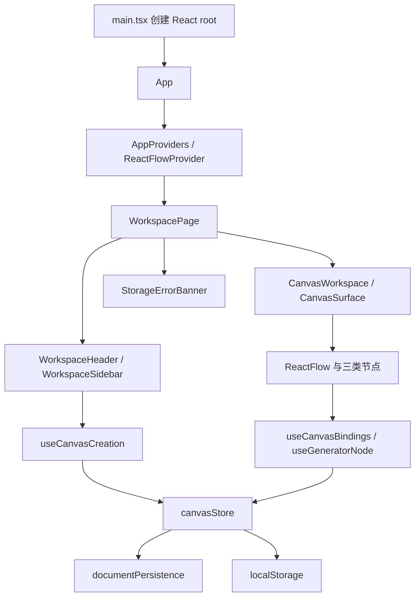

# 架构与源码地图

[返回知识库](README.md)

## 技术栈与职责

| 技术 | 承担的职责 |
| --- | --- |
| React 19 与 TypeScript | 界面组合与类型约束 |
| React Flow 12.12 | 画布坐标、视口、拖动、连接与选择 |
| Zustand 5 | 受控领域文档、业务操作与保存反馈 |
| Tailwind CSS 4 | utility 样式、语义设计 token 与 Vite 集成 |
| lucide-react | 图标 |
| Vite 6 | 开发服务与生产构建 |
| Vitest 与 Playwright | 领域/store 单元测试与真实浏览器验收 |

版本范围见 [package.json](../../package.json)，实际安装版本由 [package-lock.json](../../package-lock.json) 固定。项目没有后端包、路由库或请求客户端。

## 启动链路

[main.tsx](../../src/main.tsx) 按顺序导入 React Flow 样式、Tailwind 入口、基础规则、画布覆盖样式，并用 StrictMode 渲染 App。[App](../../src/app/App.tsx) 只组合 Provider 和页面；[AppProviders](../../src/app/providers/AppProviders.tsx) 提供 React Flow 上下文，使页面和节点中的 `useReactFlow` 可用。

`useCanvasStore` 是 [canvasStore.ts](../../src/features/canvas/store/canvasStore.ts) 模块末尾创建的单例；导入模块时完成文档恢复，并在条件允许时立即保存恢复后的文档。恢复逻辑不在页面的 effect 中。

## 分层地图

| 目录 | 职责 | 代表文件 |
| --- | --- | --- |
| `src/app` | 应用组合、上下文和全局样式 | `App.tsx`、`providers/AppProviders.tsx` |
| `src/pages/workspace` | 工作区组合和帮助面板开关 | `WorkspacePage.tsx` |
| `src/features/workspace/components` | 页头、创建工具、素材、帮助与反馈 | `WorkspaceSidebar.tsx`、`StorageErrorBanner.tsx` |
| `src/features/canvas/components` | 画布表面、工具栏、缩放控件、空态、页脚 | `CanvasSurface.tsx`、`CanvasWorkspace.tsx` |
| `src/features/canvas/components/nodes` | 三种节点与共享节点结构 | `ImageNode.tsx`、`PromptNode.tsx`、`GeneratorNode.tsx` |
| `src/features/canvas/hooks` | UI 与领域操作的适配 | `useCanvasBindings.ts`、`useGeneratorNode.ts` |
| `src/features/canvas/store` | 文档操作、模拟任务、保存调度 | `canvasStore.ts` |
| `src/features/canvas/services` | 序列化、校验和恢复 | `documentPersistence.ts` |
| `src/features/canvas/utils` | 图查询、连接校验、创建避让、坐标公式 | `graph.ts`、`placement.ts`、`coordinates.ts` |
| `src/components` 与 `src/lib` | 共享布局、按钮和 class 组合 | `WorkspaceLayout.tsx`、`Button.tsx`、`cn.ts` |

## 状态和依赖方向

`WorkspacePage → feature 组件 → hooks/store → 领域工具与持久化服务` 是主要方向。共享 Button、IconButton 只处理基础界面，不读取业务 store。业务类型统一来自 [types.ts](../../src/features/canvas/types.ts)。

React Flow 接收 store 中的 `nodes`、`edges`、`viewport`，再通过 `onNodesChange`、`onEdgesChange`、`onViewportChange` 写回，形成受控循环。节点选择和测量可以存在于内存节点中，但序列化时被剔除。工作区帮助开关属于页面的 `useState`；notice、保存状态、恢复阻塞标志属于 store 会话状态，不进入 CanvasDocument。

## 按功能定位代码

| 想修改的功能 | 阅读顺序 |
| --- | --- |
| 创建入口或素材 | `CreationTools` / `SampleLibrary` → `useCanvasCreation` → `placement` → store 的 `add*` / `constants` |
| 连接规则或当前输入 | `CanvasSurface` → `useCanvasBindings` → `graph.isValidConnection/getInputs` → store 的 `connect` |
| 生成按钮与反馈 | `GeneratorNode` → `useGeneratorNode` → `GeneratorSettings` / `GenerationFeedback` → store 的 `submit/finish/retry` |
| 提示词编辑 | `PromptNode` → store 的 `updateNode` → `getInputs` |
| 删除与历史保留 | `NodeHeading` / React Flow 删除事件 → store 的 `removeNodes` |
| 保存和恢复失败 | `WorkspaceHeader` / `StorageErrorBanner` → store 的 `flushSave/startFresh` → `documentPersistence` |
| 缩放、适配、拖动 | `CanvasControls` → `useCanvasControls`；`CanvasSurface` 的 React Flow 配置 |
| 工作区外观 | `WorkspaceLayout`、workspace 组件、`app/styles/tailwind.css` 的 token |
| 节点外观 | `NodeCard/NodeHeading/NodeFooter`、`canvas/styles/theme.css` 和节点 utility classes |

## 样式约定

Tailwind 入口定义工作区 token 并导入节点主题，组件使用 utility classes；`base.css` 保留基础规则，`react-flow.css` 保留依赖库覆盖。输入框和按钮等节点内交互区域使用 `nodrag` / `nopan`，节点标题通过 `.node-heading` 成为拖动手柄。

扩展时沿用 [前端架构与维护约定](../FRONTEND_ARCHITECTURE.md)，避免将页面组合、任务生命周期和节点展示重新聚合到单个组件。
