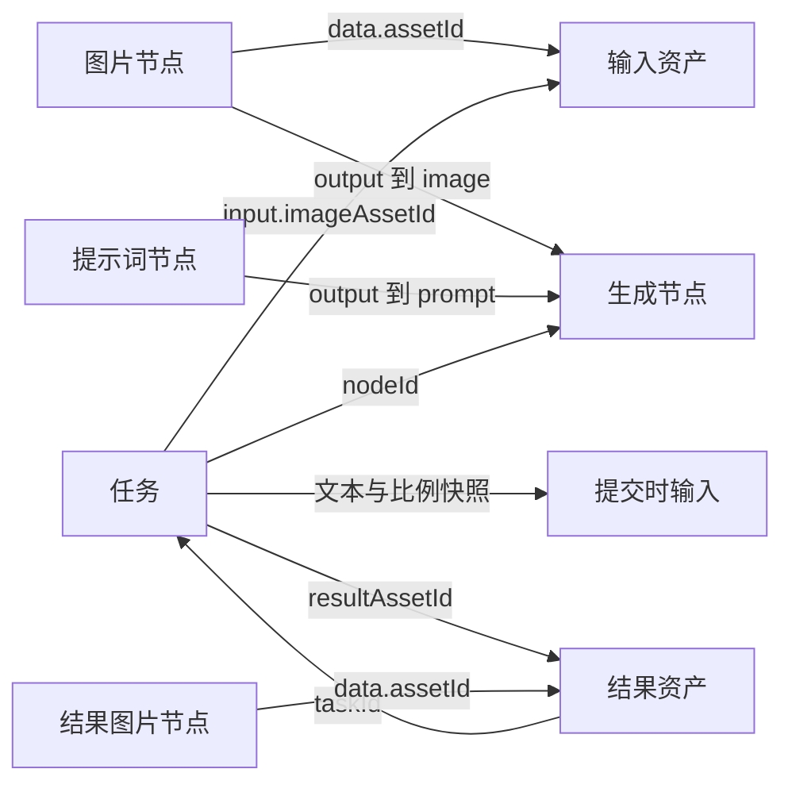

# 领域模型

[返回知识库](README.md)

## 文档作为领域数据源

[CanvasDocument](../../src/features/canvas/types.ts) 包含版本、节点、边、资产、任务和视口。一份文档对应当前唯一画布。`createEmptyDocument()` 建立版本 1、空集合以及 `{ x: 0, y: 0, zoom: 1 }` 的初始视口。

| 字段 | 类型与含义 |
| --- | --- |
| `version` | 字面量 `1`，恢复时严格检查 |
| `nodes` | `CanvasNode[]`，React Flow Node 加领域数据 |
| `edges` | React Flow `Edge[]`，节点及端口之间的连接 |
| `assets` | `Record<string, Asset>`，按资产 ID 索引 |
| `tasks` | `Task[]`，按提交顺序追加的任务历史 |
| `viewport` | `{ x, y, zoom }`，平移和缩放 |

## 实体关系

源节点 ID 用于追踪提交来源，允许相应节点后来被删除；任务所引用的图片资产必须仍然存在。结果图片仍是普通 `image` 类型，可再次连接生成节点。

## 节点与连接

`NodeKind = 'image' | 'prompt' | 'generator'`。所有节点具有稳定 `id`、世界坐标 `position` 和 `data.label`。`NodeData` 还按类型使用以下字段：

| 节点类型 | 领域字段 | 端口 |
| --- | --- | --- |
| image | `assetId` | 输出 `output` |
| prompt | `text` | 输出 `output` |
| generator | `ratio`、`failNext` | 输入 `image`、`prompt` |

[isValidConnection](../../src/features/canvas/utils/graph.ts) 要求源、目标存在且不同，目标为 generator，源为 image 或 prompt，源端口为 output，目标端口与源类型一致，且该目标端口尚无连接。因此一张图片可被多个生成节点使用，但一个生成节点每种输入仅接收一个源。不能用重复连接替换已有输入，需先删除旧连接。

`getInputs(doc, nodeId)` 遍历目标的入边，读取当前图片资产及当前提示词文本。它返回派生视图 `CanvasInputs`，不额外持久化一份输入。

## 资产

| 字段 | 含义 |
| --- | --- |
| `id/name/src` | 资产身份、名称、稳定资源路径 |
| `width/height` | 图片尺寸元数据 |
| `createdAt` | 毫秒时间戳 |
| `origin` | `sample` 或 `generated` |
| `taskId?` | 生成资产关联的成功任务 |

每次添加内置素材都会生成新的资产 ID 和节点 ID；每次任务成功也生成新的资产和节点。多次成功即使使用同一 `/samples/result.svg`，领域身份仍然不同。删除画布图片节点不会删除其资产。

## 任务

| 字段 | 含义 |
| --- | --- |
| `id/nodeId` | 任务 ID 与所属生成节点 ID |
| `input.imageAssetId` | 冻结的输入图片资产 ID |
| `input.imageNodeId/promptNodeId` | 提交时的源节点 ID，作为追踪信息 |
| `input.prompt` | 提交时的提示词原文，校验非空但不裁剪存储文本 |
| `parameters.ratio` | 提交时的比例 |
| `status` | queued / running / succeeded / failed / interrupted |
| `createdAt/updatedAt` | 创建和状态更新时间 |
| `error?` | 失败或中断的原因 |
| `resultAssetId?` | 成功结果资产 ID |
| `fail` | 本次模拟任务是否应失败；普通生成复制 failNext，原快照重试强制为 false |

只有 queued 和 running 属于活动任务。同一个生成节点不能同时存在多个活动任务。[getLatestTask](../../src/features/canvas/utils/graph.ts) 从 tasks 数组末尾向前找对应节点，因此任务数组的追加顺序具有业务含义；展示排序应使用副本。

## 会话状态与可测试依赖

[CanvasStore](../../src/features/canvas/store/canvasStore.ts) 在文档外维护 `saveStatus`、`saveError`、`recoveryBlocked` 和 `notice`。它们表达当前会话的保存与交互状态，不是持久化领域记录。

`createCanvasStore` 可注入 `storage`、`now`、`id` 和 `autoFlushEvents`。单元测试使用可控存储、时间与 ID，加上 Vitest 假定时器，验证任务和保存逻辑而不依赖真实等待。

## 扩展模型时的约束

领域类型只是静态边界。新增字段或节点类型时，还需联动创建默认值、视图、连接规则、序列化与恢复校验；只修改 TypeScript 类型会导致数据无法恢复或刷新后丢失。具体校验边界见 [保存与恢复](05-persistence.md)。
