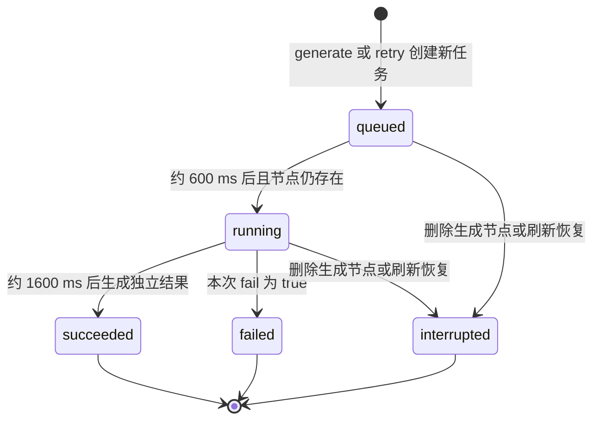

# 核心执行流程

[返回知识库](README.md)

## 创建与编辑

创建按钮经过 `CreationTools/SampleLibrary → useCanvasCreation → store.addImage/addPrompt/addGenerator`。hook 读取画布容器的 client 矩形，调用 React Flow 的 `screenToFlowPosition` 得到世界坐标，再由 `findNodePlacement` 根据已有节点尺寸寻找空位。新节点选中，旧节点和旧连线取消选择。

提示词通过 `PromptNode → updateNode` 写入 `node.data.text`；生成节点的 `getInputs` 在文档变化后读取最新文本。拖动、选择及删除由 React Flow 发出变化，`useCanvasBindings` 将事件转交 store，store 使用 `applyNodeChanges/applyEdgeChanges` 更新文档。

证据：[useCanvasCreation](../../src/features/canvas/hooks/useCanvasCreation.ts)、[placement](../../src/features/canvas/utils/placement.ts)、[PromptNode](../../src/features/canvas/components/nodes/PromptNode.tsx)、[store](../../src/features/canvas/store/canvasStore.ts)。

## 连线

React Flow 的 `isValidConnection` 在交互中调用图校验，store 的 `connect` 在提交时再次校验，合法后创建稳定边 ID。无效连接不进入文档；若调用进入 store 的 connect 后被拒绝，store 会提供 notice，交互层直接拒绝的拖线不一定触发提示。清空画布区域选择通过 hook 将选中节点与边变为未选中。

连接不会自动触发任务，提交前仍需校验图片存在且提示词 `trim()` 后非空。图规则与任务就绪判断分别负责连线合法性和生成所需内容。

## 生成状态机

重试创建另一个 queued 任务，旧任务的终态和历史记录保留。`startFresh` 清空整份文档并清理计时器，不保留中断历史。

### 提交

`GeneratorNode → useGeneratorNode.submit → generate/retry → submit` 执行以下逻辑：

1. 找到生成节点；若该节点已有活动任务，拒绝重复提交。
2. 普通生成读取当前连线，要求图片资产、两种源节点 ID 和非空提示词；重试读取原任务并确认输入资产仍在。
3. 生成新任务 ID，复制输入与比例，设置 queued 和时间戳。普通生成复制 `failNext`，重试强制 `fail=false`。
4. 追加任务，将生成节点的 `failNext` 复位为 false，并立即保存。
5. 约 600 ms 后重新检查任务仍 queued 且生成节点存在，再写 running；约 1600 ms 后进入 `finish`。

任务运行期间 UI 禁用该生成节点的比例、失败开关和重复提交。源提示词仍可编辑，但不会改写已提交任务的快照。store 的 `updateNode` 是通用操作，参数锁定主要由 UI 实施。

### 完成与独立结果

`finish(taskId)` 重新读取最新文档，只有任务仍 running 且生成节点存在才允许结束。模拟失败写入 failed 和原因；成功创建资产、图片节点，再把任务改为 succeeded 并关联 `resultAssetId`，同次提交立即保存。

结果位于完成时生成节点的右侧 `x + 390`，纵向按该节点已有成功次数乘以 400 偏移。此路径没有调用手动创建的避让算法。结果是普通图片节点，可以作为另一个生成节点的输入；系统不自动建立结果连线。

证据：[canvasStore.ts](../../src/features/canvas/store/canvasStore.ts) 的 `submit`、`later`、`finish`，以及 [useGeneratorNode](../../src/features/canvas/hooks/useGeneratorNode.ts)。

## 重试与采用当前输入

| 行为 | 数据来源 | 条件与结果 |
| --- | --- | --- |
| 重试生成 | 最新 failed/interrupted 任务的 input 和 parameters | 原资产仍在，生成节点存在且无活动任务；新建任务，原任务不变 |
| 使用当前输入重新生成 | 当前入边、提示词文本和生成节点比例 | 最新任务失败或中断且当前输入就绪时显示入口；走普通 generate，使用当前 failNext |

删除原图片或提示词节点后，原快照重试仍可成功，因为资产和文本快照保留。修改当前提示词或比例不会改变重试输入。界面通过 `retryable` 判断主按钮是否执行 retry，通过 `ready` 判断当前输入是否可重新生成。

## 删除和迟到回调

标题删除按钮与键盘删除最终走 `removeNodes`，同时删除关联边。删除生成节点时，其 queued/running 任务转 interrupted；资产和全部历史任务保留。删除源节点只清理边，已提交任务仍使用原快照继续执行。

删除节点不会逐个取消对应计时器，回调通过状态和节点存在性检查退出，避免迟到结果。`startFresh` 会清理全部任务计时器，再创建空文档。当前没有用户主动取消任务的按钮或独立取消状态。

## 世界坐标与视口

保存的节点位置为世界坐标。相对画布容器的屏幕坐标满足 `screen = zoom × world + translation`，因此 `world = (screen - translation) / zoom`；拖动距离需除以 zoom。

实际创建转换、拖动、连接和指针锚定缩放使用 React Flow。`utils/coordinates.ts` 的 `screenToWorld` 用于领域公式测试，未接入当前创建 hook。React Flow 配置缩放范围为 0.25～2，标题拖动阈值为 0；恢复时使用保存视口，不在挂载时自动 fitView 覆盖它。

证据：[CanvasSurface](../../src/features/canvas/components/CanvasSurface.tsx)、[useCanvasControls](../../src/features/canvas/hooks/useCanvasControls.ts)、[coordinates](../../src/features/canvas/utils/coordinates.ts)、[domain.test](../../src/features/canvas/domain.test.ts)。
