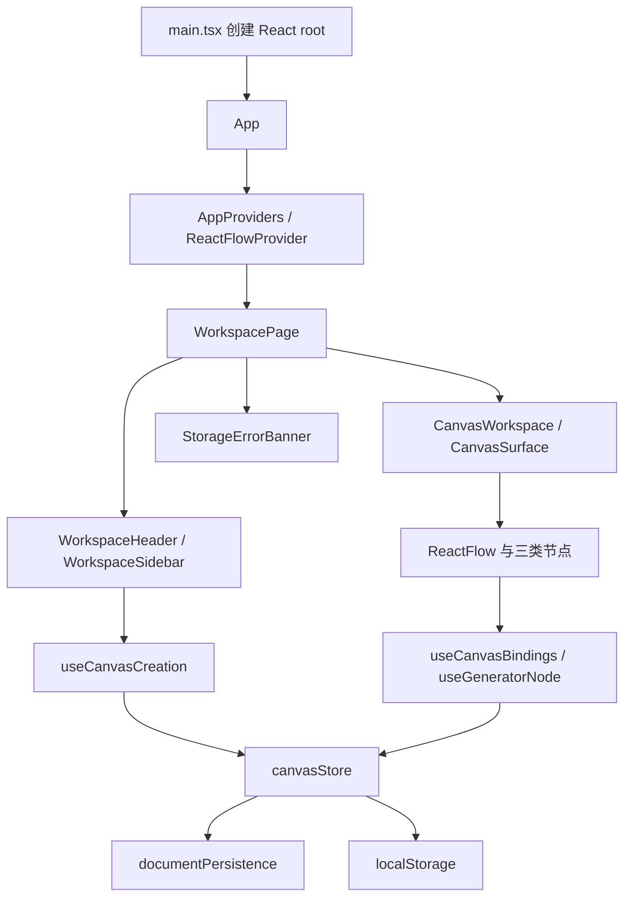
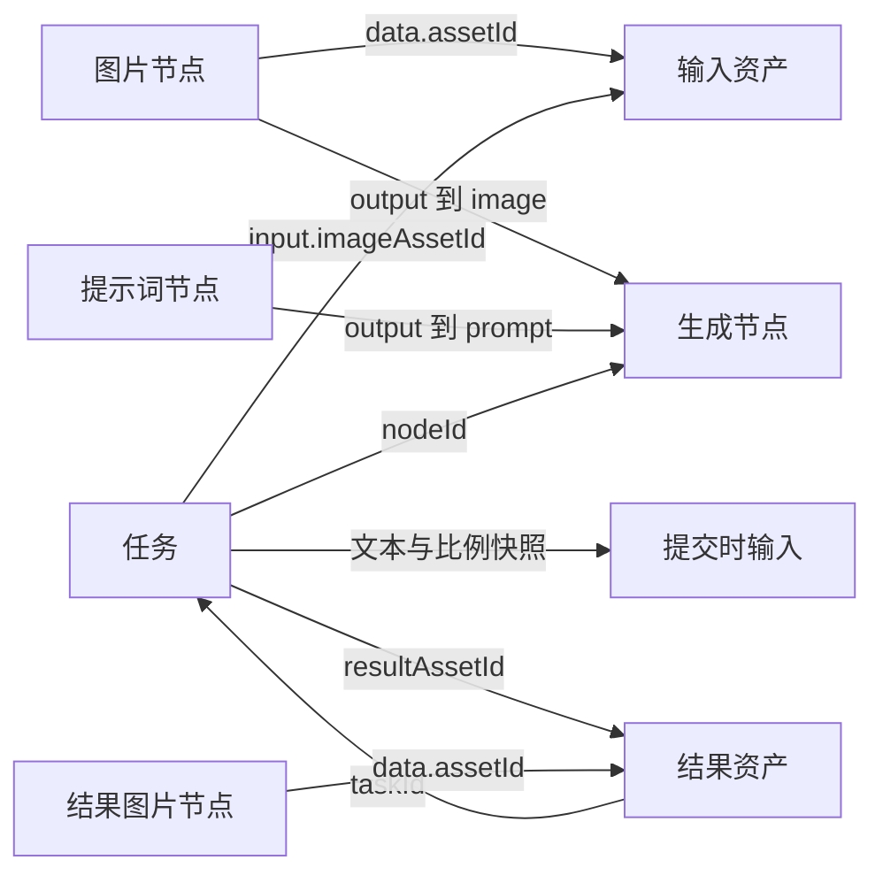
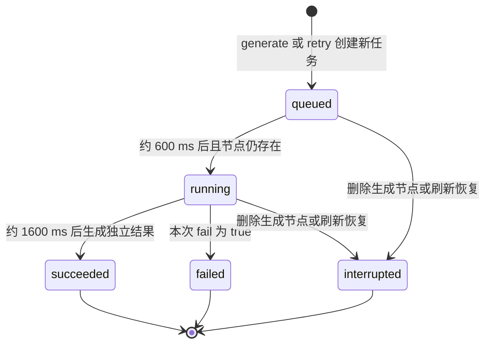

# Infinite 项目知识库

Infinite 是单项目、纯前端的智能图片创作画布 P0 Demo。用户把图片和提示词连接到生成节点，提交模拟异步任务，再把结果图片用于下一次创作。当前没有真实图片模型、后端、账号或上传能力。

知识库依据 2026-10-08 的代码基线 `917b3f1` 整理。功能事实以实现和行为规范为准，历史验收结果保留原日期；后续修改应同时维护对应章节。本文件包含全部知识库正文；也可通过 [交互导航页](index.html) 按模块搜索和查看代码证据。

## 目录

| 章节 | 解决的问题 |
| --- | --- |
| [项目概览](#项目概览) | 项目做什么、有哪些功能、哪些能力尚未实现 |
| [架构与源码地图](#架构与源码地图) | 应用如何启动、职责如何分层、各功能去哪里改 |
| [领域模型](#领域模型) | 节点、连接、资产、任务和文档如何关联 |
| [核心执行流程](#核心执行流程) | 创建、连线、生成、重试、删除、坐标处理如何执行 |
| [保存与恢复](#保存与恢复) | 自动保存时机、恢复校验、异常和数据保护如何工作 |
| [开发与验证](#开发与验证) | 如何启动、测试、构建，规范和验收记录在哪里 |
| [维护与扩展](#维护与扩展) | 常见问题如何定位、改功能要联动哪些文件 |

## 十分钟阅读路径

1. 读项目概览，确认固定 mock、单标签页和本地存储的范围。
2. 沿 `main.tsx → App → AppProviders → WorkspacePage → CanvasSurface` 看页面如何组合。
3. 对照领域模型读 `types.ts` 和 `utils/graph.ts`，分清节点与资产、当前输入与任务快照。
4. 读 `canvasStore.ts` 的 `submit → later → finish` 及 `retry`，理解任务生命周期。
5. 读 `documentPersistence.ts` 和保存与恢复章节，再用单元测试和浏览器用例核对边界。

## 必须先分清的概念

| 概念 | 当前含义 |
| --- | --- |
| 图片节点与资产 | 节点是画布上的表示；资产保存图片引用及元数据。删除节点会清理连接，资产和历史任务仍保留 |
| 当前输入与任务快照 | 当前输入由连线实时推导；任务提交时复制图片资产 ID、提示词文本和比例，之后不随编辑变化 |
| 重试与重新生成 | 重试使用失败或中断任务的原快照创建新任务；“使用当前输入重新生成”重新读取当前连线与参数 |
| 中断与取消 | 当前只有 `interrupted`，没有取消按钮、取消 API 或 `cancelled` 状态 |
| 保存失败与恢复失败 | 保存失败允许重试写入；恢复失败会阻止覆盖原数据，需用户明确新建本地画布 |

## 项目概览

### 产品目标

Infinite 通过无限画布表达图片创作流程：图片节点提供参考素材，提示词节点提供文本，生成节点聚合两种输入并展示异步任务；成功后新增图片节点，形成可继续连接的创作结果。首次打开没有预置节点，侧栏提供三种节点创建入口和三张内置素材。

主要实现位于 [canvas feature](../../src/features/canvas/)，页面和工具侧栏位于 [WorkspacePage](../../src/pages/workspace/WorkspacePage.tsx) 与 [workspace feature](../../src/features/workspace/components/)。

### 已实现功能

| 能力 | 用户行为与限制 | 主要入口 |
| --- | --- | --- |
| 节点创建 | 创建图片、提示词、生成节点，或点击内置素材；手动创建寻找空位 | `useCanvasCreation`、`findNodePlacement`、store 的 `add*` |
| 画布编辑 | 标题拖动、平移、缩放、适配视口、选择、取消选择和删除 | `CanvasSurface`、`useCanvasBindings`、`useCanvasControls` |
| 类型化连线 | 图片连生成节点的 image 端口，提示词连 prompt 端口；每种输入仅一条连接 | `isValidConnection`、store 的 `connect` |
| 模拟生成 | 图片及非空提示词就绪后提交；比例支持 `1:1`、`4:3`、`16:9` | `useGeneratorNode`、store 的 `submit` |
| 失败和重试 | 一次性失败开关；失败或中断任务可按原快照重试，也可采用当前输入重新生成 | `retry`、`generate` |
| 独立结果和复用 | 成功新建资产与图片节点，原图保留；结果图片能连到其他生成节点 | store 的 `finish` |
| 自动保存 | 节点、连线、任务和视口写入 localStorage；显示保存状态 | `commit`、`flushSave` |
| 刷新恢复 | 恢复终态；排队或运行任务转为中断；坏数据保护 | `restoreDocument`、`StorageErrorBanner` |

源码证据：[图约束](../../src/features/canvas/utils/graph.ts)、[状态与操作](../../src/features/canvas/store/canvasStore.ts)、[节点视图模型](../../src/features/canvas/hooks/useGeneratorNode.ts)。

### 模拟服务边界

任务在浏览器内约排队 600 ms、生成 1600 ms，由 `setTimeout` 推进。所有成功任务都引用固定 `/samples/result.svg`，并不根据提示词或输入图片执行模型推理。比例只改变任务参数和结果尺寸元数据：`1:1 → 960×960`、`4:3 → 960×720`、`16:9 → 1280×720`。

素材定义见 [constants.ts](../../src/features/canvas/constants.ts)，图片文件见 [public/samples](../../public/samples/)，时间推进与尺寸映射见 [canvasStore.ts](../../src/features/canvas/store/canvasStore.ts) 的 `submit` 和 `finish`。

### 当前范围

| 项目 | 现状 |
| --- | --- |
| 项目与路由 | 一份画布文档、一个工作区页面，没有路由库或多项目管理 |
| 图片输入 | 三张内置 SVG；没有文件上传、粘贴图片或远程素材导入 |
| 服务与身份 | 无后端、真实模型 API、登录和 API Key 配置 |
| 存储 | 浏览器 localStorage，按来源隔离，不支持跨设备同步 |
| 并发 | 一个生成节点只允许一个活动任务；不同生成节点可各自提交；不合并多个标签页的保存 |
| 任务控制 | 无主动取消按钮；删除生成节点会中断活动任务，刷新后恢复为中断 |
| 历史与性能 | 保留资产和任务历史，尚无垃圾回收、配额管理或大型图专项优化 |

README 末尾的 `POST /tasks`、查询、取消、重试等接口属于未来接入方案。当前生成链只调用 store 和定时器；`services/documentPersistence.ts` 是本地文档服务。

### 演示路径

1. 创建一张图片、一个提示词节点和一个生成节点，填写提示词并连线。
2. 编辑提示词，观察生成节点展示的当前输入同步变化。
3. 提交任务，观察排队、运行、成功及新增结果图片。
4. 把结果图片连到另一个生成节点，展示结果复用。
5. 触发一次失败，修改输入后重试，比较原快照与当前输入重新生成的区别。
6. 刷新检查节点与视口恢复；在生成中刷新检查中断；删除源节点检查连线清理和历史保留。

完整操作说明与已有界面截图见 [项目 README](../../README.md)。

## 架构与源码地图

### 技术栈与职责

| 技术 | 承担的职责 |
| --- | --- |
| React 19 与 TypeScript | 界面组合与类型约束 |
| React Flow 12.12 | 画布坐标、视口、拖动、连接与选择 |
| Zustand 5 | 受控领域文档、业务操作与保存反馈 |
| Tailwind CSS 4 | utility 样式、语义设计 token 与 Vite 集成 |
| lucide-react | 图标 |
| Vite 6 | 开发服务与生产构建 |
| Vitest 与 Playwright | 领域/store 单元测试与真实浏览器验收 |

版本范围见 [package.json](../../package.json)，实际安装版本由 [package-lock.json](../../package-lock.json) 固定。项目没有后端包、路由库或请求客户端。

### 启动链路



[main.tsx](../../src/main.tsx) 按顺序导入 React Flow 样式、Tailwind 入口、基础规则、画布覆盖样式，并用 StrictMode 渲染 App。[App](../../src/app/App.tsx) 只组合 Provider 和页面；[AppProviders](../../src/app/providers/AppProviders.tsx) 提供 React Flow 上下文，使页面和节点中的 `useReactFlow` 可用。

`useCanvasStore` 是 [canvasStore.ts](../../src/features/canvas/store/canvasStore.ts) 模块末尾创建的单例；导入模块时完成文档恢复，并在条件允许时立即保存恢复后的文档。恢复逻辑不在页面的 effect 中。

### 分层地图

| 目录 | 职责 | 代表文件 |
| --- | --- | --- |
| `src/app` | 应用组合、上下文和全局样式 | `App.tsx`、`providers/AppProviders.tsx` |
| `src/pages/workspace` | 工作区组合和帮助面板开关 | `WorkspacePage.tsx` |
| `src/features/workspace/components` | 页头、创建工具、素材、帮助与反馈 | `WorkspaceSidebar.tsx`、`StorageErrorBanner.tsx` |
| `src/features/canvas/components` | 画布表面、工具栏、缩放控件、空态、页脚 | `CanvasSurface.tsx`、`CanvasWorkspace.tsx` |
| `src/features/canvas/components/nodes` | 三种节点与共享节点结构 | `ImageNode.tsx`、`PromptNode.tsx`、`GeneratorNode.tsx` |
| `src/features/canvas/hooks` | UI 与领域操作的适配 | `useCanvasBindings.ts`、`useGeneratorNode.ts` |
| `src/features/canvas/store` | 文档操作、模拟任务、保存调度 | `canvasStore.ts` |
| `src/features/canvas/services` | 序列化、校验和恢复 | `documentPersistence.ts` |
| `src/features/canvas/utils` | 图查询、连接校验、创建避让、坐标公式 | `graph.ts`、`placement.ts`、`coordinates.ts` |
| `src/components` 与 `src/lib` | 共享布局、按钮和 class 组合 | `WorkspaceLayout.tsx`、`Button.tsx`、`cn.ts` |

### 状态和依赖方向

`WorkspacePage → feature 组件 → hooks/store → 领域工具与持久化服务` 是主要方向。共享 Button、IconButton 只处理基础界面，不读取业务 store。业务类型统一来自 [types.ts](../../src/features/canvas/types.ts)。

React Flow 接收 store 中的 `nodes`、`edges`、`viewport`，再通过 `onNodesChange`、`onEdgesChange`、`onViewportChange` 写回，形成受控循环。节点选择和测量可以存在于内存节点中，但序列化时被剔除。工作区帮助开关属于页面的 `useState`；notice、保存状态、恢复阻塞标志属于 store 会话状态，不进入 CanvasDocument。

### 按功能定位代码

| 想修改的功能 | 阅读顺序 |
| --- | --- |
| 创建入口或素材 | `CreationTools` / `SampleLibrary` → `useCanvasCreation` → `placement` → store 的 `add*` / `constants` |
| 连接规则或当前输入 | `CanvasSurface` → `useCanvasBindings` → `graph.isValidConnection/getInputs` → store 的 `connect` |
| 生成按钮与反馈 | `GeneratorNode` → `useGeneratorNode` → `GeneratorSettings` / `GenerationFeedback` → store 的 `submit/finish/retry` |
| 提示词编辑 | `PromptNode` → store 的 `updateNode` → `getInputs` |
| 删除与历史保留 | `NodeHeading` / React Flow 删除事件 → store 的 `removeNodes` |
| 保存和恢复失败 | `WorkspaceHeader` / `StorageErrorBanner` → store 的 `flushSave/startFresh` → `documentPersistence` |
| 缩放、适配、拖动 | `CanvasControls` → `useCanvasControls`；`CanvasSurface` 的 React Flow 配置 |
| 工作区外观 | `WorkspaceLayout`、workspace 组件、`app/styles/tailwind.css` 的 token |
| 节点外观 | `NodeCard/NodeHeading/NodeFooter`、`canvas/styles/theme.css` 和节点 utility classes |

### 样式约定

Tailwind 入口定义工作区 token 并导入节点主题，组件使用 utility classes；`base.css` 保留基础规则，`react-flow.css` 保留依赖库覆盖。输入框和按钮等节点内交互区域使用 `nodrag` / `nopan`，节点标题通过 `.node-heading` 成为拖动手柄。

扩展时沿用 [前端架构与维护约定](../FRONTEND_ARCHITECTURE.md)，避免将页面组合、任务生命周期和节点展示重新聚合到单个组件。

## 领域模型

### 文档作为领域数据源

[CanvasDocument](../../src/features/canvas/types.ts) 包含版本、节点、边、资产、任务和视口。一份文档对应当前唯一画布。`createEmptyDocument()` 建立版本 1、空集合以及 `{ x: 0, y: 0, zoom: 1 }` 的初始视口。

| 字段 | 类型与含义 |
| --- | --- |
| `version` | 字面量 `1`，恢复时严格检查 |
| `nodes` | `CanvasNode[]`，React Flow Node 加领域数据 |
| `edges` | React Flow `Edge[]`，节点及端口之间的连接 |
| `assets` | `Record<string, Asset>`，按资产 ID 索引 |
| `tasks` | `Task[]`，按提交顺序追加的任务历史 |
| `viewport` | `{ x, y, zoom }`，平移和缩放 |

### 实体关系



源节点 ID 用于追踪提交来源，允许相应节点后来被删除；任务所引用的图片资产必须仍然存在。结果图片仍是普通 `image` 类型，可再次连接生成节点。

### 节点与连接

`NodeKind = 'image' | 'prompt' | 'generator'`。所有节点具有稳定 `id`、世界坐标 `position` 和 `data.label`。`NodeData` 还按类型使用以下字段：

| 节点类型 | 领域字段 | 端口 |
| --- | --- | --- |
| image | `assetId` | 输出 `output` |
| prompt | `text` | 输出 `output` |
| generator | `ratio`、`failNext` | 输入 `image`、`prompt` |

[isValidConnection](../../src/features/canvas/utils/graph.ts) 要求源、目标存在且不同，目标为 generator，源为 image 或 prompt，源端口为 output，目标端口与源类型一致，且该目标端口尚无连接。因此一张图片可被多个生成节点使用，但一个生成节点每种输入仅接收一个源。不能用重复连接替换已有输入，需先删除旧连接。

`getInputs(doc, nodeId)` 遍历目标的入边，读取当前图片资产及当前提示词文本。它返回派生视图 `CanvasInputs`，不额外持久化一份输入。

### 资产

| 字段 | 含义 |
| --- | --- |
| `id/name/src` | 资产身份、名称、稳定资源路径 |
| `width/height` | 图片尺寸元数据 |
| `createdAt` | 毫秒时间戳 |
| `origin` | `sample` 或 `generated` |
| `taskId?` | 生成资产关联的成功任务 |

每次添加内置素材都会生成新的资产 ID 和节点 ID；每次任务成功也生成新的资产和节点。多次成功即使使用同一 `/samples/result.svg`，领域身份仍然不同。删除画布图片节点不会删除其资产。

### 任务

| 字段 | 含义 |
| --- | --- |
| `id/nodeId` | 任务 ID 与所属生成节点 ID |
| `input.imageAssetId` | 冻结的输入图片资产 ID |
| `input.imageNodeId/promptNodeId` | 提交时的源节点 ID，作为追踪信息 |
| `input.prompt` | 提交时的提示词原文，校验非空但不裁剪存储文本 |
| `parameters.ratio` | 提交时的比例 |
| `status` | queued / running / succeeded / failed / interrupted |
| `createdAt/updatedAt` | 创建和状态更新时间 |
| `error?` | 失败或中断的原因 |
| `resultAssetId?` | 成功结果资产 ID |
| `fail` | 本次模拟任务是否应失败；普通生成复制 failNext，原快照重试强制为 false |

只有 queued 和 running 属于活动任务。同一个生成节点不能同时存在多个活动任务。[getLatestTask](../../src/features/canvas/utils/graph.ts) 从 tasks 数组末尾向前找对应节点，因此任务数组的追加顺序具有业务含义；展示排序应使用副本。

### 会话状态与可测试依赖

[CanvasStore](../../src/features/canvas/store/canvasStore.ts) 在文档外维护 `saveStatus`、`saveError`、`recoveryBlocked` 和 `notice`。它们表达当前会话的保存与交互状态，不是持久化领域记录。

`createCanvasStore` 可注入 `storage`、`now`、`id` 和 `autoFlushEvents`。单元测试使用可控存储、时间与 ID，加上 Vitest 假定时器，验证任务和保存逻辑而不依赖真实等待。

### 扩展模型时的约束

领域类型只是静态边界。新增字段或节点类型时，还需联动创建默认值、视图、连接规则、序列化与恢复校验；只修改 TypeScript 类型会导致数据无法恢复或刷新后丢失。具体校验边界见 [保存与恢复](#保存与恢复)。

## 核心执行流程

### 创建与编辑

创建按钮经过 `CreationTools/SampleLibrary → useCanvasCreation → store.addImage/addPrompt/addGenerator`。hook 读取画布容器的 client 矩形，调用 React Flow 的 `screenToFlowPosition` 得到世界坐标，再由 `findNodePlacement` 根据已有节点尺寸寻找空位。新节点选中，旧节点和旧连线取消选择。

提示词通过 `PromptNode → updateNode` 写入 `node.data.text`；生成节点的 `getInputs` 在文档变化后读取最新文本。拖动、选择及删除由 React Flow 发出变化，`useCanvasBindings` 将事件转交 store，store 使用 `applyNodeChanges/applyEdgeChanges` 更新文档。

证据：[useCanvasCreation](../../src/features/canvas/hooks/useCanvasCreation.ts)、[placement](../../src/features/canvas/utils/placement.ts)、[PromptNode](../../src/features/canvas/components/nodes/PromptNode.tsx)、[store](../../src/features/canvas/store/canvasStore.ts)。

### 连线

React Flow 的 `isValidConnection` 在交互中调用图校验，store 的 `connect` 在提交时再次校验，合法后创建稳定边 ID。无效连接不进入文档；若调用进入 store 的 connect 后被拒绝，store 会提供 notice，交互层直接拒绝的拖线不一定触发提示。清空画布区域选择通过 hook 将选中节点与边变为未选中。

连接不会自动触发任务，提交前仍需校验图片存在且提示词 `trim()` 后非空。图规则与任务就绪判断分别负责连线合法性和生成所需内容。

### 生成状态机



重试创建另一个 queued 任务，旧任务的终态和历史记录保留。`startFresh` 清空整份文档并清理计时器，不保留中断历史。

#### 提交

`GeneratorNode → useGeneratorNode.submit → generate/retry → submit` 执行以下逻辑：

1. 找到生成节点；若该节点已有活动任务，拒绝重复提交。
2. 普通生成读取当前连线，要求图片资产、两种源节点 ID 和非空提示词；重试读取原任务并确认输入资产仍在。
3. 生成新任务 ID，复制输入与比例，设置 queued 和时间戳。普通生成复制 `failNext`，重试强制 `fail=false`。
4. 追加任务，将生成节点的 `failNext` 复位为 false，并立即保存。
5. 约 600 ms 后重新检查任务仍 queued 且生成节点存在，再写 running；约 1600 ms 后进入 `finish`。

任务运行期间 UI 禁用该生成节点的比例、失败开关和重复提交。源提示词仍可编辑，但不会改写已提交任务的快照。store 的 `updateNode` 是通用操作，参数锁定主要由 UI 实施。

#### 完成与独立结果

`finish(taskId)` 重新读取最新文档，只有任务仍 running 且生成节点存在才允许结束。模拟失败写入 failed 和原因；成功创建资产、图片节点，再把任务改为 succeeded 并关联 `resultAssetId`，同次提交立即保存。

结果位于完成时生成节点的右侧 `x + 390`，纵向按该节点已有成功次数乘以 400 偏移。此路径没有调用手动创建的避让算法。结果是普通图片节点，可以作为另一个生成节点的输入；系统不自动建立结果连线。

证据：[canvasStore.ts](../../src/features/canvas/store/canvasStore.ts) 的 `submit`、`later`、`finish`，以及 [useGeneratorNode](../../src/features/canvas/hooks/useGeneratorNode.ts)。

### 重试与采用当前输入

| 行为 | 数据来源 | 条件与结果 |
| --- | --- | --- |
| 重试生成 | 最新 failed/interrupted 任务的 input 和 parameters | 原资产仍在，生成节点存在且无活动任务；新建任务，原任务不变 |
| 使用当前输入重新生成 | 当前入边、提示词文本和生成节点比例 | 最新任务失败或中断且当前输入就绪时显示入口；走普通 generate，使用当前 failNext |

删除原图片或提示词节点后，原快照重试仍可成功，因为资产和文本快照保留。修改当前提示词或比例不会改变重试输入。界面通过 `retryable` 判断主按钮是否执行 retry，通过 `ready` 判断当前输入是否可重新生成。

### 删除和迟到回调

标题删除按钮与键盘删除最终走 `removeNodes`，同时删除关联边。删除生成节点时，其 queued/running 任务转 interrupted；资产和全部历史任务保留。删除源节点只清理边，已提交任务仍使用原快照继续执行。

删除节点不会逐个取消对应计时器，回调通过状态和节点存在性检查退出，避免迟到结果。`startFresh` 会清理全部任务计时器，再创建空文档。当前没有用户主动取消任务的按钮或独立取消状态。

### 世界坐标与视口

保存的节点位置为世界坐标。相对画布容器的屏幕坐标满足 `screen = zoom × world + translation`，因此 `world = (screen - translation) / zoom`；拖动距离需除以 zoom。

实际创建转换、拖动、连接和指针锚定缩放使用 React Flow。`utils/coordinates.ts` 的 `screenToWorld` 用于领域公式测试，未接入当前创建 hook。React Flow 配置缩放范围为 0.25～2，标题拖动阈值为 0；恢复时使用保存视口，不在挂载时自动 fitView 覆盖它。

证据：[CanvasSurface](../../src/features/canvas/components/CanvasSurface.tsx)、[useCanvasControls](../../src/features/canvas/hooks/useCanvasControls.ts)、[coordinates](../../src/features/canvas/utils/coordinates.ts)、[domain.test](../../src/features/canvas/domain.test.ts)。

## 保存与恢复

### 存储格式

浏览器 localStorage 的键为 `infinite-canvas:v1`，文档内部 `version` 为 `1`。保存的是 JSON 元数据和内置 `/samples/*.svg` 引用，没有图片二进制、临时 object URL 或远程图片 URL。协议、域名和端口不同会形成不同来源的存储空间，`localhost` 与 `127.0.0.1` 不是同一份画布。

证据：[constants.ts](../../src/features/canvas/constants.ts)、[documentPersistence.ts](../../src/features/canvas/services/documentPersistence.ts)。

### 保存内容与瞬态

`serializeDocument` 对节点保留 `id/type/position/data` 并写入标题拖动手柄；对边保留 ID、两端节点、端口及 type；同时保存 assets、tasks 和 viewport。节点选择、测量和拖拽瞬态不进入 JSON，保存状态、notice 和 recoveryBlocked 也不进入文档。

节点 `data` 在保存时整体写入，恢复时按节点类型重建已知字段。因此新加的 data 字段必须补充恢复逻辑，不能认为序列化后就一定能恢复。

### 自动保存时机

| 时机 | 实现 |
| --- | --- |
| 普通节点、连线、视口变化 | `commit` 重置 140 ms 防抖计时器，随后 `flushSave` |
| 任务提交、状态推进、完成及节点删除 | `commit(next, true)` 立即写入 |
| 页面离开或转为隐藏 | pagehide / visibilitychange 调用 `flushSave` |
| 初始化成功且存储可用 | 立即保存恢复后的文档，将活动任务的中断状态落盘 |
| 用户重试保存 | `retrySave → flushSave` |

保存开始时置 saving；成功 `setItem` 后置 saved；写入失败置 error 并显示“数据尚未保存”。内存状态已变更不代表磁盘保存成功。时序与状态见 [canvasStore.ts](../../src/features/canvas/store/canvasStore.ts) 的 `commit/flushSave`。

### 恢复校验

`restoreDocument(raw, now)` 先完成结构和关系校验，再交出可用文档：

1. JSON 可解析，version 为 1；nodes/edges/tasks 为数组，assets/viewport 为对象。
2. ID 非空且不使用保留字段；节点和任务 ID 不重复；位置、时间、尺寸和视口值为有限数；尺寸及 zoom 大于零。
3. 节点类型、比例、失败标志和字段有效；图片节点引用的资产存在；资产索引与其 ID 一致，资源路径在内置白名单中。
4. 边 ID 不重复，源/目标与端口满足正常连线规则；每个生成输入端口最多一条边。
5. 任务输入资产存在；仍在图中的任务 owner/源节点必须有正确类型；成功任务必须带有效结果资产。
6. 活动任务的生成节点必须存在，且同一节点仅有一个活动任务；带 taskId 的资产须指向匹配的成功任务和结果引用。
7. queued/running 统一改为 interrupted，更新时间更新并提示刷新中断；终态保留。

允许历史任务引用已删除的生成节点或输入节点，因为节点是画布表示，任务输入资产与文本快照才是执行依据。校验并非所有未来业务规则的替代：扩展字段、资源和状态时需显式补充。

### 异常恢复策略

| 情况 | 内存表现 | 原始数据与用户操作 |
| --- | --- | --- |
| 没有保存数据 | 空画布 | 初始化后正常保存 |
| 合法 v1 文档 | 恢复节点、连接、资产、任务和视口 | 活动任务变中断后保存 |
| JSON 损坏、未知版本或关系无效 | 空画布并置 `recoveryBlocked=true`，显示恢复失败 | 不自动覆盖 localStorage 原文；用户点“新建本地画布”才允许替换 |
| localStorage 读取或访问抛错 | 显示保存失败，恢复阻塞标志不因这类错误自动置 true | 重试尝试写入当前内存文档，不会重新读取恢复旧文档 |
| 写入失败 | 当前画布仍可操作，saveStatus=error | “重试保存”再次写入；未成功前不能声称已保存 |

恢复阻塞不会冻结内存画布，用户仍可编辑，但这些修改不会写入原存储。“新建本地画布”会清理任务定时器、清空节点/边/资产/任务、解除阻塞并立即写入空文档，应先保留需要抢救的原始 JSON。

证据：[createCanvasStore/startFresh](../../src/features/canvas/store/canvasStore.ts)、[StorageErrorBanner](../../src/features/workspace/components/StorageErrorBanner.tsx)。

### 演进边界

当前恢复只支持 v1，没有版本迁移。恢复生成节点缺少 ratio 时使用 `1:1`，而新建节点和正常生成/UI 的默认值为 `4:3`；处理历史数据时需分别遵循这些路径。

未来加入上传需要同时设计图片持久化介质和资源校验，不能只把 object URL 放进当前 src。多标签页尚无版本冲突检测或 storage 事件合并；资产与任务不断累积，需要另行设计引用检查与清理策略。

## 开发与验证

### 环境与命令

需要 Node.js 20 或更新版本及 npm。应用运行不需要环境文件、API Key、数据库或后端服务；精确依赖以 package-lock.json 为准。

```bash
npm ci
npm run dev
```

开发服务默认绑定 `127.0.0.1`，打开终端显示的地址。固定使用同一来源查看同一画布，避免切换 localhost、IP 或端口后误以为数据丢失。

| 命令 | 真实行为 |
| --- | --- |
| `npm run dev` | `vite --host 127.0.0.1`，本地开发服务 |
| `npm test` | `vitest run`，执行 `src/**/*.test.ts`，Node 测试环境 |
| `npm run test:watch` | Vitest 监听模式 |
| `npm run build` | 先 `tsc --noEmit`，再 Vite 生产构建到 dist |
| `npm run preview` | 在本机预览已有生产构建 |
| `npm run test:e2e` | Playwright 执行 tests 目录下浏览器用例 |

没有单独 lint 脚本，类型检查已包含在 build。tsconfig 的 include 仅为 src，build 的类型检查不覆盖 tests 目录和根配置文件。配置见 [package.json](../../package.json)、[vite.config.ts](../../vite.config.ts)、[tsconfig.json](../../tsconfig.json)。

### 浏览器验收环境

[playwright.config.ts](../../playwright.config.ts) 默认使用一个 Chromium 项目、一个 worker、零重试、1440×1000 视口。优先读取 `PLAYWRIGHT_CHROME_EXECUTABLE`，否则使用 macOS 已安装的 Google Chrome；都没有时使用 Playwright 浏览器，可按需运行 `npx playwright install chromium` 安装。

Playwright 自动启动 `npm run dev -- --host 127.0.0.1 --port 5173`，测试来源为 `http://localhost:5173`；非 CI 环境允许复用同地址服务。失败时保留截图和 trace，HTML 报告写入 playwright-report。执行前确认复用的是本项目服务。

### 测试地图

| 文件 | 用例数 | 主要覆盖 |
| --- | --- | --- |
| [domain.test.ts](../../src/features/canvas/domain.test.ts) | 10 | 坐标公式、类型化连接、序列化瞬态剔除、资源/版本/关系恢复校验 |
| [canvasStore.test.ts](../../src/features/canvas/store/canvasStore.test.ts) | 16 | 输入快照、失败/重试、重复提交、独立结果、删除、中断、存储异常 |
| [canvas.spec.ts](../../tests/canvas.spec.ts) | 8 | 真实创建/连线、缩放和拖动、任务与结果复用、刷新和异常保护 |
| [workspace.spec.ts](../../tests/workspace.spec.ts) | 2 | 空态入口、指南开关和缩放控件协作；写入失败反馈与重试保存 |
| [spec-acceptance.spec.ts](../../tests/spec-acceptance.spec.ts) | 7 | 选择清除/删除、排队刷新、原快照重试、未知版本、读失败、当前输入重生成、多节点导航 |

单元测试用假定时器推进任务；浏览器测试使用真实鼠标、键盘和端口拖动。[tests/helpers/canvas.ts](../../tests/helpers/canvas.ts) 提供创建基础图、连接端口、读取文档与等待保存等公共操作。

计数反映本知识库代码基线；2026-10-01 的历史验收为 26 项单元、17 项 E2E、TypeScript 检查和构建通过，详见 [验收报告](../../openspec/changes/build-p0-canvas-demo/verification.md)。文档中的历史通过结果不替代每次改动后的实际检查。

2026-10-08 知识库整理时，重新执行 `npm test`，26 项单元测试全部通过；`npm run build` 的 TypeScript 检查和生产构建通过。此前分章节版本的 83 个 Markdown 相对链接、HTML 脚本语法与 JSON 一致性检查通过，Playwright 检查导航页搜索和证据面板成功且无控制台错误。本次未改应用交互，未重跑 17 项应用 E2E。

### OpenSpec 知识入口

活动变更为 `openspec/changes/build-p0-canvas-demo`：

| 工件 | 内容 |
| --- | --- |
| [proposal.md](../../openspec/changes/build-p0-canvas-demo/proposal.md) | 产品目的、范围与能力划分 |
| [design.md](../../openspec/changes/build-p0-canvas-demo/design.md) | 原始技术设计与取舍 |
| [tasks.md](../../openspec/changes/build-p0-canvas-demo/tasks.md) | 8 项已勾选实施任务 |
| [canvas-editing/spec.md](../../openspec/changes/build-p0-canvas-demo/specs/canvas-editing/spec.md) | 画布操作、连线、删除与坐标规则 |
| [generation-tasks/spec.md](../../openspec/changes/build-p0-canvas-demo/specs/generation-tasks/spec.md) | 任务快照、状态、失败重试、独立结果与复用 |
| [canvas-persistence/spec.md](../../openspec/changes/build-p0-canvas-demo/specs/canvas-persistence/spec.md) | 保存、刷新中断、损坏保护与错误反馈 |
| [verification.md](../../openspec/changes/build-p0-canvas-demo/verification.md) | 13 条需求、15 个场景的实现和验收矩阵 |

原始 design 中的普通 CSS 描述早于 Tailwind 重构，当前架构以源码及 FRONTEND_ARCHITECTURE.md 为准。change 尚未同步到 `openspec/specs` 或归档；这两个目录当前仅有占位文件。已勾选实施任务不等于已归档。

已安装 OpenSpec CLI 时可运行 `openspec validate build-p0-canvas-demo --strict` 检查工件结构；它不执行浏览器功能验收。

### 提交规则

按 [AGENTS.md](../../AGENTS.md) 先检查工作区、差异、remote、当前分支和最近提交。每个完整逻辑变更对应一个明确的 Conventional Commit，只暂存相关文件，验证后提交并及时 push；禁止覆盖用户修改或擅自 force push。涉及交互时运行 E2E；测试缓存、依赖、构建产物和环境密钥不提交。

## 维护与扩展

### 常见问题定位

| 现象 | 优先检查 | 解释或处理路径 |
| --- | --- | --- |
| 生成按钮不可用 | `useGeneratorNode.ready/active/retryable` 与最新任务 | 普通生成需要有效图片和非空提示词；原快照重试不要求当前连线存在；活动任务期间不能重复提交 |
| 连不上线 | `graph.isValidConnection` | 检查源节点类型、output、对应输入端口、端口是否已被占用 |
| 修改提示词后重试仍用旧内容 | `retry → submit(previous)` | 符合快照语义；要采用新内容，点“使用当前输入重新生成” |
| 每次结果图看起来一样 | `RESULT_SRC` 与 `finish` | 当前返回固定 mock SVG，提示词不驱动真实模型 |
| 刷新后任务中断 | `restoreDocument` | 浏览器定时器无法跨刷新恢复；按原快照重试会新建任务 |
| 删除图片后任务还能完成 | `removeNodes` 与 task.input | 删除源节点保留资产与任务快照，活动任务无需当前连线 |
| 删除生成节点后没有结果 | `removeNodes`、排队回调、`finish` | 活动任务被中断，迟到回调检查状态和 owner 后退出 |
| 画布刷新后变空 | 来源是否变化、存储原文、错误横幅 | 区分不同来源、无数据与恢复失败；不要先清空 localStorage |
| 显示保存失败 | `flushSave`、storage 适配器 | 内存编辑不等于已保存；检查浏览器权限/配额，使用重试保存 |
| 恢复失败后编辑不能保存 | `recoveryBlocked` | 正在保护原 JSON；保留原文后才决定新建空画布 |
| 重复添加或结果节点重叠 | `placement` 与 `finish` 两条路径 | 手动添加找空位；生成结果按固定偏移摆放，复杂布局仍可能重叠 |
| 新增节点字段刷新后消失 | `restoreNode` | 恢复只重建已知字段，需补校验与恢复逻辑 |

源码入口：[图工具](../../src/features/canvas/utils/graph.ts)、[生成 hook](../../src/features/canvas/hooks/useGeneratorNode.ts)、[store](../../src/features/canvas/store/canvasStore.ts)、[持久化](../../src/features/canvas/services/documentPersistence.ts)。

### 修改功能的联动范围

| 改动 | 必须联动的部分 | 验证重点 |
| --- | --- | --- |
| 新增节点类型 | types、创建 action/hook、侧栏、nodeTypes/节点组件、graph、序列化/恢复 | 创建、拖动、连接、删除、刷新 |
| 新增生成参数 | NodeData、创建默认值、Settings、Task.parameters、submit 快照、恢复校验、结果解释 | 原快照重试、新输入重生成、旧数据兼容 |
| 修改连接规则 | graph、端口、store.connect、恢复边校验 | UI 与恢复规则一致，非法边不会通过导入 |
| 增加素材 | public/samples、SAMPLE_ASSETS、恢复资源白名单 | 资源路径稳定，旧数据仍可打开 |
| 修改任务行为 | TaskStatus、isActiveTask、submit/finish/retry、Feedback、恢复转换 | 非法迁移、重复提交、删除竞争、刷新与重试 |
| 修改存储结构 | version、serialize/restore、错误保护、迁移设计 | 旧文档兼容、坏数据不覆盖、失败可见 |
| 修改画布交互或布局 | React Flow 配置、hooks、共享节点结构、tokens | 多缩放坐标、真实端口拖动、窄视口布局 |

### 容易破坏的约束

- 不混用 nodeId、assetId 和 taskId；删除节点不等于删除资产或任务。
- task.input 和 parameters 是提交快照，不能改成运行时重新读取当前节点。
- 最新任务依赖 tasks 的追加顺序，不能原地按时间或状态重排。
- 同一个生成节点最多一个活动任务，UI 禁用和 store 校验都要保留。
- `finish` 必须检查任务状态和生成节点存在，避免中断后发布结果。
- 恢复阻塞时不得自动写回空文档或“修复”原始存储。
- 新增持久化字段需同时处理序列化、恢复和旧版本行为。
- 新建比例默认 `4:3` 与恢复缺失比例默认 `1:1` 属于不同路径，不应误写成统一规则。

### 未来接入真实生成服务

以下为扩展方向，当前未实现：

1. 把浏览器定时器替换成任务服务适配层，提交冻结输入；通过轮询或服务端事件同步服务端状态。
2. 为提交意图建立稳定幂等标识，网络重发复用同一标识；超时后先查询，避免重复任务和结果。
3. 用服务端条件更新或事务处理完成与取消竞争；前端断线后重查任务，不直接断言失败。
4. 通过 IndexedDB 或对象存储保存上传图片，文档继续引用稳定资产 ID；临时签名 URL 按需获取。
5. 为存储升级建立显式版本迁移；多项目、多标签协作和资产清理分别设计身份、冲突和引用策略。

更完整的未来 HTTP 方案见 [项目 README 的后端追问准备](../../README.md#后端技术追问准备)。实施新需求前先更新相应行为规范，再处理领域类型、store、恢复与测试，保持扩展边界清晰。

## 原有文档与证据

| 来源 | 用途 |
| --- | --- |
| [项目 README](../../README.md) | 操作指南、演示路径和历史运行结果 |
| [前端架构约定](../FRONTEND_ARCHITECTURE.md) | 分层、样式和组件扩展规则 |
| [OpenSpec 三份行为规范](../../openspec/changes/build-p0-canvas-demo/specs/) | 画布编辑、任务生成、持久化的需求与场景 |
| [OpenSpec 验收报告](../../openspec/changes/build-p0-canvas-demo/verification.md) | 13 条需求、15 个场景与测试的对应关系 |
| [AI 使用记录](../AI_USAGE.md) | 开发过程和工具验证记录 |
| [面试编码要求](../../面试编码要求-智能无限画布.md) | 初始题目与交付范围 |

## 知识库维护

本文件是完整的项目知识库。修改业务行为时，直接维护对应章节的规则与源码入口，并联动相关行为规范和测试；只有实际执行检查后才更新验收日期与结果。`index.html` 和 `project-data.json` 是交互摘要与机器索引，涉及摘要的改动应同步更新。`.project-intake/` 为已忽略的本地扫描底稿。

## 供后续 AI 分析的上下文

```text
项目：Infinite，单项目纯前端智能画布 P0 Demo。
技术：React 19、TypeScript、React Flow 12.12、Zustand 5、Tailwind CSS 4、Vite 6。
入口：src/main.tsx → src/app/App.tsx → AppProviders → WorkspacePage。
领域：src/features/canvas/types.ts 与 utils/graph.ts。
状态/模拟任务：src/features/canvas/store/canvasStore.ts。
保存/恢复：src/features/canvas/services/documentPersistence.ts。
关键约束：输入类型与每端口单连接；提交冻结输入；重试用原快照；每次成功新建资产和图片节点；删除节点保留历史；坏数据不自动覆盖。
运行：npm ci、npm run dev；验证：npm test、npm run build、npm run test:e2e。
边界：固定本地 SVG mock；localStorage v1；无后端/上传/账号/跨设备同步/多标签并发合并。
先阅读 docs/knowledge-base/README.md 和 AGENTS.md；不要把 README 的未来 HTTP 方案当成现有实现。
```
